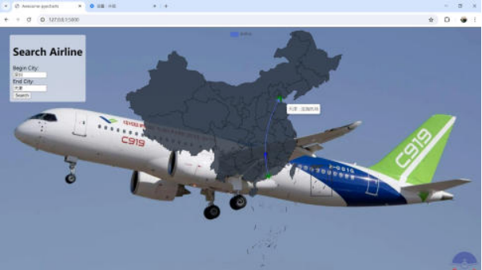
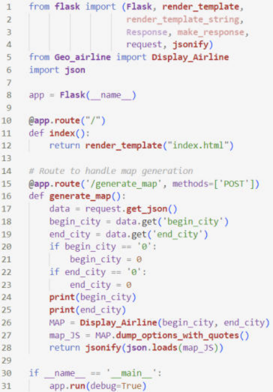
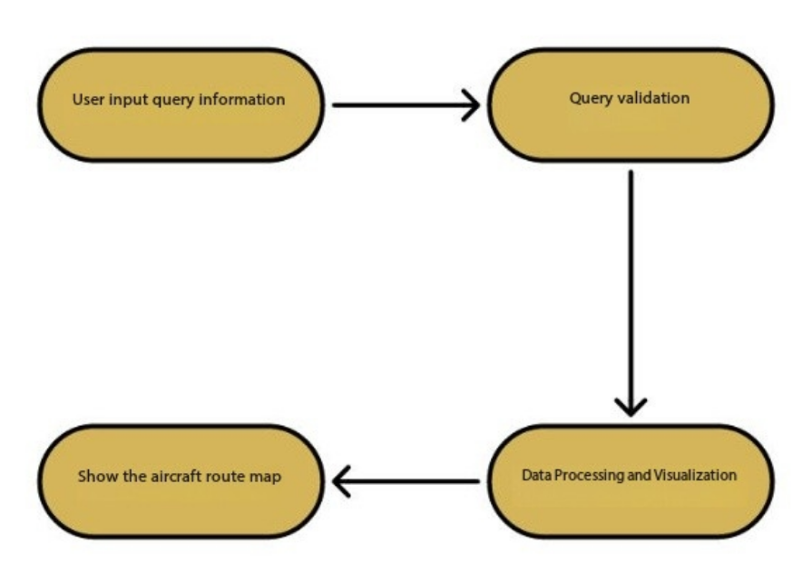

# China-Airplane-Route-Inquiry-Website

## Abstract

The system is designed to enhance users' convenience and real-time perception of air travel through efficient retrieval of route information and map visualization. The design employs the Flask framework based on Python, achieving a decoupled architecture for the front and back ends. It integrates RESTful APIs and the pyecharts map service API to support real-time queries and flight path displays upon user input of city information.

The design thoroughly considers the system's stability and concurrency control mechanisms, ensuring that it maintains a good response speed and user experience even under high load conditions. Additionally, the system incorporates error handling and logging functionalities to address potential exceptions, thereby improving its reliability and security. The design concepts and implementation strategies presented in this paper can provide guidance and reference for the development and implementation of similar systems.

## Background
Aviation industry in China in recent years, flight network increasingly dense, in order to facilitate the passenger query route information, improve the efficiency of travel, develop a whole China route query system has important practical significance of the system will provide the majority of passengers with convenient and quick route query service, promote the development of air travel, improve user travel experience.

## Running Platform: Web Terminal

## Basic Design Concepts And Processes

Basic design concept: The national route query system will be developed using the Flask framework of Python, aiming to establish a simple and efficient route query platform. The system design concepts include:
- Lightweight framework: Use the Flask framework to simplify the development process and improve the development efficiency. 
- RESTful API: The clear design of RESTful API makes the interaction between the front end and the back end simple and clear. Modular design: the system is divided into two modules: front end and back end, which process user interface and data logic respectively, reduce coupling degree and improve maintainability. 
- Map service integration: Combined with **pyecharts** map service API, realize visual display of routes and enhance user experience. [1]

Processes:
1. The user enters the starting city and the destination city through the front-end interface, and initiates the query request. 
2. Flask After receiving the request, the request is forwarded to the corresponding route processing function. 
3. The route processing function calls the back-end logic module to process the route query requests. 
4. The back-end logic module queries the route data according to the city information input by the user.
5. If a direct route connection exists, the back-end logic module returns the query result to the route processing function.

## Framework
### Front-end Module
- User interface (UI): interact with the user, receive the user input city information and display the query results.
- Map display module: visualize the query results and the route path on the map. 
- Front-end logic control: process user input and map interaction events, call the corresponding back-end API, and initiate a request.

> 
> 
> (Demo, the front-end interface)

### Back-end Module
- Routing: Responsible for receiving requests from the front end and distributing them to the corresponding processing functions. 
- Business logic processing: including the implementation of air route query, data processing and other functions. 
- Data interface: Interacts with route data, and performs query and update operations.
- Error handling: handle possible abnormal conditions during the operation of the system to ensure system stability.

### Data Module
- Route data table: store the route information between cities, including the starting city, destination city, and airport.

### External Service Integration
- Map service API: Integrated with the third-party map service pyecharts to realize the map display function of the route path.

> 
> 
> (Backend Flask framework example code)

## The Relationship Between The Functional Requirements And The Program

| Function Requirement                                      | Program                                           |
|----------------------------------------------------------|---------------------------------------------------|
| User inputs the starting city and destination city to query flight routes | Front-end Interface: HTML, CSS, JavaScript        |
| The system queries the database and returns flight route information | Back-end Business Logic: Python Flask Framework   |
| Displays the flight path on the map                            | Map Display Module: JavaScript + Map Service API  |
| Error handling: Handles potential exceptions that may occur during system operation to ensure stability | Back-end Error Handling Module: Python Flask Framework |
| Queries flight data from the database                       | Database Module: MySQL or other relational databases |

## Unresolved Problem
Route information is not real-time and may change.

## Data Structure

- City and coordinates with the airport [2]:
| Field Name | Data Type | Description                      |
|------------|-----------|----------------------------------|
| City       | String    | Name of the city                |
| Latitude   | Float     | Latitude of the city (degrees)  |
| Longitude  | Float     | Longitude of the city (degrees) |

- Domestic flight data:
| Field Name        | Data Type | Description                          |
|-------------------|-----------|--------------------------------------|
| Departure City    | String    | City where the flight departs       |
| Arrival City      | String    | City where the flight arrives        |
| Departure Airport  | String    | Airport from which the flight departs |
| Arrival Airport    | String    | Airport at which the flight arrives  |

> 
> 
> Data flow

### References

[1] Ponlawat Khamlae, Chollakorn Nimpattanavong, Worawat Choensawat, and Kingkarn Sookhanaphibarn. Visualization system for air traffic data. In 2020 IEEE 9th Global Conference on Consumer Electronics (GCCE), pages 213–214, 2020.

[2] National Bureau of Statistics of China. Official Website of the National Bureau of Statistics of China. Accessed: 2024-04-13.